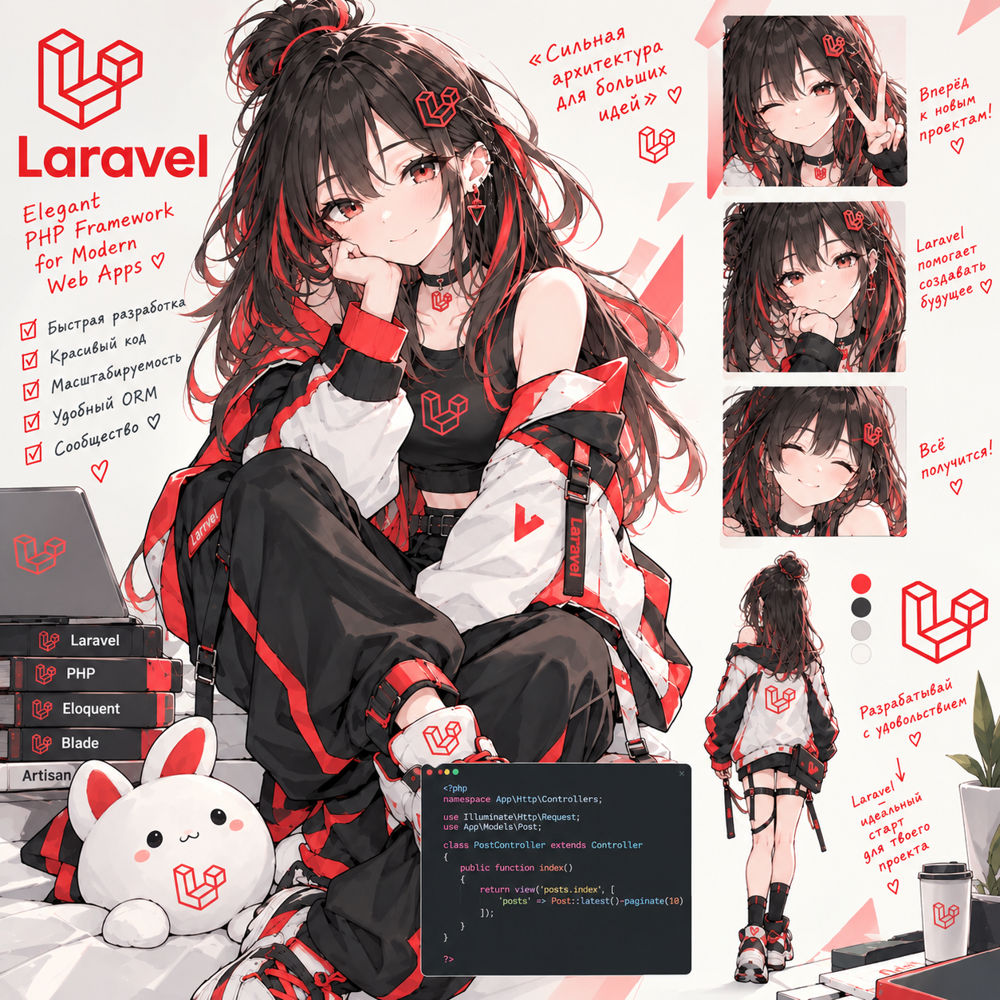

# Laravel Lab — TaskFlow

> **24.09.2026 — методичка вычитана и исправлена.** Что найдено и что поправлено — в [fixes/laravel.md](https://github.com/meeymirita/lab-fixes/blob/main/laravel.md) репозитория `lab-fixes`.

**Статус: ⚪ методичка готова, прохождение впереди.**
**Сложность: высокая.** Нужен базовый Laravel (роутинг, контроллеры, миграции, Blade — даются ссылками на документацию, без разбора), ООП на PHP (см. [oop-lab](https://github.com/meeymirita/oop-lab)) и общее представление про очереди (см. [rabbitmq-lab](https://github.com/meeymirita/rabbitmq-lab)) — лаба на них ссылается, а не объясняет заново.

## О чём

Laravel 13 "изнутри" — не "как вызвать", а что происходит на каждом слое фреймворка (~30 компонентов `illuminate/*`, связанных через контейнер), на сквозном таск-трекере **TaskFlow** с воркспейсами, ролями и приглашениями.

## Стек

Laravel 13 (PHP 8.4) + PostgreSQL 17 + Redis 7 + RabbitMQ 4 + Mailpit + Laravel Reverb; фронт — Vue 3 + Vite (JavaScript, только API-клиент). Всё в Docker.

## Формат

Методичка [`Laravel_Lab_TaskFlow.html`](Laravel_Lab_TaskFlow.html) — открывается в браузере.

## Что внутри (10 сессий)

- **Сессия 1** — стенд (Docker, Laravel 13, Sanctum/Reverb/RabbitMQ-драйвер), схема данных и миграции
- **Сессия 2** — Eloquent: связи, pivot, N+1 — разбираем боль по шагам (`hasMany`/`belongsTo`, `belongsToMany` + свой Pivot-класс, `attach`/`sync`/`toggle`, полиморфные связи, `hasManyThrough`)
- **Сессия 3** — коллекции (`groupBy`/`partition`/`reduce`/`keyBy`), API Resources (`whenLoaded`/`whenCounted`), три вида пагинации
- **Сессия 4** — HTTP-слой: Form Requests, своё middleware с параметром, обработка исключений API, полноценный CRUD задач
- **Сессия 5** — Service Container и провайдеры: `build`/`bind`/`call` изнутри, contextual binding (`when`/`needs`/`give`)
- **Сессия 6** — Auth: Sanctum SPA (cookie + CSRF), Gate и Policy, роли, приглашения по токену + минимальный Vue-фронт (логин, доска)
- **Сессия 7** — Observer (жизненный цикл модели), события и Listeners, Job (retry, `ShouldBeUnique`, `failed_jobs`) на RabbitMQ — та же схема, что в rabbitmq-lab
- **Сессия 8** — Mailable (markdown-письма, очередь), Notification (mail + database), Scheduler (дайджест задач)
- **Сессия 9** — `Cache::remember` + инвалидация в Observer, `Cache::lock` от гонки, RateLimiter, Broadcasting через Reverb + Echo
- **Сессия 10** — фабрики для всех моделей, feature-тесты (`RefreshDatabase`), fakes/моки (Event/Notification/Mail), финальный прогон

Лаба построена вокруг карты Laravel (`Kernel → Middleware → Router → Controller`, плюс сквозные Container/Events/Auth и менеджеры Database/Cache/Queue/Mail/Broadcasting) и проходит по каждому слою последовательно — от жизненного цикла запроса до тестов.

---

Часть сборного репозитория лабораторных работ — [submodule-group-lab](https://github.com/meeymirita/submodule-group-lab).
